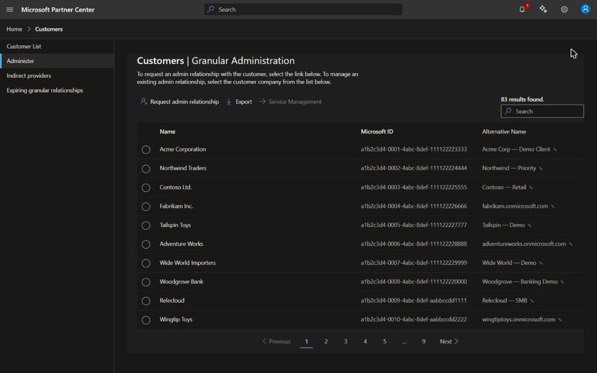

# Partner Center Alternative Names

A Chrome extension that adds an editable **Alternative Name** column to the Microsoft Partner Center **Customers | Granular Administration** (GDAP) page, and lets you search customers by those names.

Microsoft's GDAP customer list only shows each customer's display name and tenant ID — which is rarely how you actually think of your customers. This extension shows each customer's primary domain and lets you assign your own private label to any customer, then makes the built-in search box match those labels too.



## Features

- **Extra column** — adds an "Alternative Name" column to the customer grid, showing each customer's primary domain (e.g. `acmecorp.onmicrosoft.com`).
- **Editable labels** — double-click a cell (or use the ✎ button) to give a customer your own custom name. Custom names are highlighted and can be reset to the original with ↺.
- **Searchable** — typing in Partner Center's search box also matches your custom names, so searching *"Demo Client"* finds the customer even though its Microsoft display name is something else.
- **Fast** — customer data is fetched once and cached locally for 30 days; the column survives pagination and search without re-fetching.
- **Private** — everything stays in your browser. See the [Privacy Policy](https://joachimcarrein.github.io/PartnerCenterAlternativeNames/privacy.html).

## How it works

The customer grid lives inside a Shadow DOM web component, and Partner Center's search is entirely server-side. The extension:

1. Injects the column into the grid's shadow root and keeps it alive with a `MutationObserver` (pagination and search mutate the DOM in place).
2. Fetches customer domains/names from Microsoft's own Partner Center APIs, relayed through the background service worker (MV3 content scripts can't call those APIs directly due to CORS). Auth tokens are read fresh from the page's `sessionStorage` and used only to authorize these read-only lookups.
3. Makes custom names searchable via a `MAIN`-world script (`search-inject.js`) that expands the outgoing OData `$filter` with `OR tenantId eq '…'` clauses for matching customers — so the server returns rows that only a custom name matched.

Custom names and the domain cache are stored in `chrome.storage.local` and never leave the device.

## Installation (unpacked / developer mode)

1. Download or clone this repository.
2. Open `chrome://extensions` in Chrome.
3. Enable **Developer mode** (top right).
4. Click **Load unpacked** and select this folder (the one containing `manifest.json`).
5. Open the Partner Center GDAP page:
   `https://partner.microsoft.com/dashboard/v2/customers/granularadminaccess/list`

After changing any extension file, click the **reload** (↻) icon on the extension's card in `chrome://extensions`, then refresh the page.

> Requires Chrome 111+ (the search integration uses a `MAIN`-world content script).

## Building a distributable package

`build.ps1` packs the runtime files into a versioned zip (suitable for the Chrome Web Store):

```powershell
./build.ps1
```

This produces `dist/partner-center-alternative-names-<version>.zip` containing only `manifest.json`, `background.js`, `content.js`, `search-inject.js`, and `icons/` — nothing else.

## Project structure

| File | Purpose |
|------|---------|
| `manifest.json` | MV3 manifest — permissions, host access, content scripts |
| `content.js` | Isolated-world content script — column injection, data fetching, caching, editing |
| `search-inject.js` | `MAIN`-world script — rewrites the search `$filter` to make custom names searchable |
| `background.js` | Service worker — relays authenticated API calls (bypasses content-script CORS) |
| `icons/` | Extension icons |
| `build.ps1` | Packs the extension into a versioned zip |
| `.plan/` | Development notes / change history |

## Permissions

- **`storage`** — save the local domain cache and your custom labels.
- **Host access** to `partner.microsoft.com` and Microsoft's Partner Center APIs (`api.partnercenter.microsoft.com`, `api.partnercustomersecurity.microsoft.com`) — to run on the GDAP page and look up customer domains/names.

The extension performs **no** administrative actions, contains no analytics or remote code, and sends no data to any third party.

## Privacy

See the [Privacy Policy](https://joachimcarrein.github.io/PartnerCenterAlternativeNames/privacy.html). In short: all data is processed locally or exchanged only with Microsoft's own first-party APIs.
